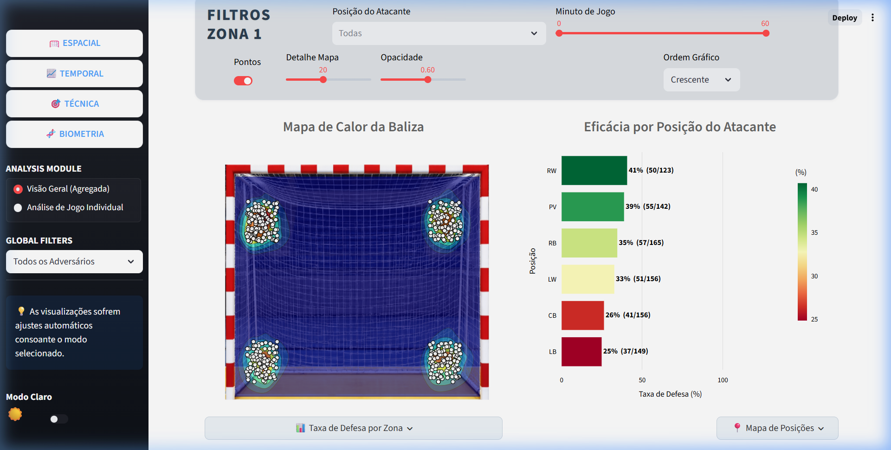

# 🧤 Digital Twin: Análise de Performance de Guarda-Redes de Andebol

[](https://www.python.org/)
[](https://streamlit.io/)
[](https://plotly.com/)
[](https://opensource.org/licenses/MIT)

> [!IMPORTANT]
> **Atualização de Portfólio Elite**: Esta versão foi elevada para um **nível profissional**, incluindo modelos preditivos de Machine Learning, suporte bilingue (PT/EN) e geração automática de relatórios em PDF.

## 🌟 Visão Geral

Este projeto implementa uma estratégia de **Digital Twin** (Gémeo Digital) para a análise de performance e biometria de Guarda-Redes de Andebol em tempo real. Ao mapear dados físicos (frequência cardíaca, tempo de reação) e eventos técnicos (posição do remate, resultado) num dashboard digital, oferece aos treinadores e equipas técnicas um "Centro de Comando" para tomada de decisões de alta performance.



---

## 🚀 Funcionalidades Principais

O sistema está organizado em quatro módulos de análise especializada:

### 1. 🥅 Visualização Espacial (Zona 1)
- **Mapa de Calor da Baliza**: Mapa interativo que mostra a densidade de remates e golos na área de 3m x 2m.
- **Grelha de Eficácia 3x3**: Taxas de defesa detalhadas para nove setores da baliza (Topo/Meio/Base x Esquerda/Centro/Direita).
- **Mapeamento de Posição do Atacante**: Análise de performance baseada na função do atacante (Ponta, Pivot, Lateral, Central).

### 2. 🧠 Gémeo Preditivo (Módulo ML)
- **Mapa de Probabilidade de Defesa**: Utiliza um classificador **Random Forest** para prever probabilidades de defesa em tempo real.
- **Simulação Dinâmica**: Ajuste variáveis como técnica de remate, velocidade e frequência cardíaca do guarda-redes para visualizar a resposta prevista do "Gémeo Digital".

### 3. 📈 Evolução Temporal (Zona 2)
- **Matriz de Eficácia**: Monitoriza o sucesso técnico ao longo de uma sequência de jogos para identificar tendências de fadiga ou adaptação tática.
- **Filtragem Dinâmica**: Isola tipos de remate específicos ou intervalos de tempo durante a época.

### 4. 🎯 Dinâmica Técnica (Zona 3)
- **Ranking de Eficácia**: Taxas de sucesso em diferentes tipos de remate (ex: 6m, 9m, Contra-ataque).
- **Análise de Velocidade de Reação**: Medição precisa dos tempos de reação (ms) para otimizar o treino cognitivo.

### 5. 🧬 Biometria e Performance Humana (Zona 4)
- **Monitorização Fisiológica**: Acompanhamento da frequência cardíaca (BPM) sincronizada com eventos de jogo.
- **Correlação de Pearson ($R$)**: Cálculo estatístico automático da correlação entre fadiga (BPM) e performance cognitiva (Tempo de Reação).

### 6. 🌍 Bilingue e Relatórios
- **Seletor PT/EN**: Suporte total de internacionalização para todo o dashboard.
- **Exportação de Resumo PDF**: Gera um relatório de performance profissional com um clique.

---

## 🛠️ Stack Tecnológica

- **Core**: Python 3.10+
- **Frontend/Dashboard**: Streamlit (para UI web interativa de alta performance)
- **Motor de Dados**: Pandas (processamento complexo de séries temporais e eventos)
- **Machine Learning**: Scikit-learn (Random Forest Classifier para previsão de defesas)
- **Visualização**: Plotly Graph Objects & Express
- **Relatórios**: FPDF2 (geração dinâmica de PDF)
- **Processamento de Imagem**: Pillow & Kaleido

---

## 💡 Aprendizagem e Desafios

Este projeto representou uma imersão profunda na interseção entre **Data Science** e **Alta Performance Desportiva**:

1.  **Conceito de Digital Twin**: Tradução de sinais biológicos em insights táticos acionáveis.
2.  **Modelação Preditiva**: Implementação e deploy de um modelo de ML num dashboard em tempo real.
3.  **Correlação de Pearson no Desporto**: Quantificação da relação matemática entre fadiga fisiológica (BPM) e output motor (Tempo de Reação).
4.  **Internacionalização (i18n) Profissional**: Construção de um sistema de localização escalável.

---

## 🔧 Melhorias Futuras

Para elevar esta plataforma a um nível de produção profissional, estão planeadas várias melhorias:
- **Deteção de Anomalias**: Identificação de picos anormais de frequência cardíaca ou quedas no tempo de reação.
- **APIs de Wearables em Tempo Real**: Integração direta com sensores (como Polar ou Garmin) para ingestão de dados ao vivo.
- **UX Mobile-First**: Otimização para uso em tablets/telemóveis por treinadores no banco de suplentes.
- **Benchmarking Multi-Jogador**: Módulo para análise comparativa entre diferentes guarda-redes do plantel.

---

## 🏁 Como Executar

### Instalação Local

1.  **Clonar o repositório**:
    ```bash
    git clone https://github.com/antonio-mmc/handball-digital-twin.git
    cd handball-digital-twin
    ```
2.  **Instalar dependências**:
    ```bash
    pip install -r requirements.txt
    ```
3.  **Iniciar o Dashboard**:
    ```bash
    streamlit run app.py
    ```

---

## 📂 Estrutura do Projeto

- `app.py`: Ponto de entrada principal do Dashboard (Streamlit).
- `charts.py`: Motor de visualização (lógica Plotly).
- `utils.py`: Processamento de dados, filtragem e gestão de temas.
- `style.css`: Estilização profissional personalizada.
- `data/`: Contém `dataset_guarda_redes_v2.csv` (log de performance core).
- `assets/`: Recursos de imagem para mapeamento espacial.

---

## 👤 Autor

**António Correia**
*Projeto de Visualização de Informação*

---

## 📜 Licença

Este projeto está licenciado sob a [MIT License](LICENSE).